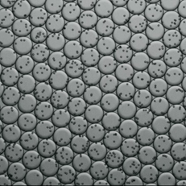
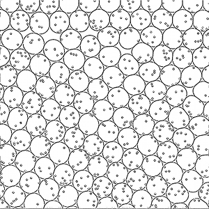

## Detecting cell frequencies with computer vision

My biologist friend wants to be able to take an image like what's below, with an array water droplets containing varying numbers of cells, and automatically determine the frequency distribution of cells per droplet.

Here's what I've been able to do so far:

Here's how I've approached the various sub-problems:

1. Detecting droplets. Ordinary circle-detection with OpenCV got most of the way there, but there were some complications regarding the non-circular shapes that come up when the packing structure isn't clean. I ended up defining each droplet with multiple overlapping circles of slightly varying radius--the outermost circle boundaries define the droplets well, and it's still easy to detect when a cell is inside a droplet.

2. Detecting cells. This is the tough part that has the greatest potential for improvement. Right now I'm using a two step process--first, I use circle detection on smaller circles to get all the cells, plus a lot of false positives. I sorted those into cells and non-cells to get training data, and then I used a neural network with one hidden layer. The network distinguishes my test set with 90% accuracy for positive assignments, and 99% accuracy for negative assignments. This could probably be improved by using a CNN, but the performance bottleneck is probably the not-so-great test data. I also think there is probably a fundamentally different approach to recognition of so many equally-sized images.

3. Image processing. My main pre-processing step was to scale the images to be larger--OpenCV restricts some parameters to integer values (minDist, minRadius, maxRadius), and this lets me get around that. All of my other processing efforts seemed to have very little impact. The image below looks like it would be much easier to work with, but I found that my cell recognition performed no better--maybe the canny edge detection is already accomplishing most of what I was trying to do by hand with pre-processing. 

4. Containment/belonging. Each droplet cluster is made of a number of circles. I find the circle center that each cell is closest to, and then I assign the cell to the corresponding cluster. I also check that the cell is contained inside at least one of the cluster circles, as a way of getting rid of false positives that lie outside the droplets, but this shouldn't be necessary once cell detection is improved.

### File descriptions
- [cell_counter.py](cell_counter.py): Main code for counting cells per droplet
- [classifier_util.py](classifier_util.py): Tools for training models to recognize cells
- [simple_cell_classifier.py](simple_cell_classifier.py): One-layer classifier with sigmoid activation
- [hidden_layer_cell_classifier.py](hidden_layer_cell_classifier.py): Two-layer classifier