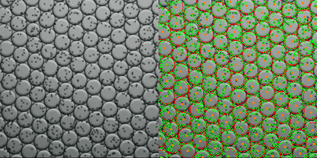

## Detecting cell frequencies with computer vision

My biologist friend would like to be able to take an image like what's below, with an array water droplets containing varying numbers of cells, and automatically determine the frequency distribution of cells per droplet.

My initial plan is to divide this into two tasks: detecting the water droplets and detecting the cells. Once both have been detected, I can associate each cell with its containing droplet and get the desired frequencies. Since the droplets are mostly circles, it seems detecting them should be straightforward, and OpenCV has a built-in tool for circle detection.

With lots of borrowing from the documentation example, I was able to get OpenCV doing a good job of detecting droplets and a not-so-great job of detecting cells:

Besides detecting droplets and detecting cells, there are two additional tasks: image pre-processing and determining what, if any, droplet contains a cell. Thoughts on these four tasks:

1. Detecting droplets. The simple circle detection does a pretty good job if they're evenly spaced, but it misaligns a few, and other images contain cells that 
are quite misshapen. I could turn down the false positive rate and only take nice circular ones, since the distribution of cells is apparently independent of droplet shape. But there are enough misshapen cells that it would be good to be at least somewhat able to cope with the weird shapes. One possible idea would be to fit rotatable ellipses, or a more complicated idea would be to try to use a polar equation to describe r varying smoothly with theta--smoothed, because it would have to not get tripped up by cells on the edge of the droplet. Sounds hard.

2. Detecting cells. Circle detection seems to be tougher for these--there are many more false positives. One approach would be to get as many false positives as are necessary to get all the true positives, then filter them down, possibly based on darkness and being inside a cell. Another approach would be to try to bypass detection altogether by looking at density above some type of threshold. This could be rounded to give an integer result, or perhaps it would be useful even in non-integer form. A third approach would be to do more sophisticated image recognition--what's the appropriate tool for a binary classifier with small, uniform-scale images with little variation?

3. Image processing. First, scale the images to be larger--OpenCV restricts some parameters to integer values (minDist, minRadius, maxRadius), and this let's me get around that. Second, it seems like some type of localized threshold could make these images a lot 
easier to work with. For a given small region, could a threshold be used which is halfway in between the lightest value present and the darkest? But this would run into trouble when run in a section that was either all white or all black. Still, it seems like there is a way to get this to be a black and white image, and this would neutralize the [checker-shadow-illusion](https://en.wikipedia.org/wiki/Checker_shadow_illusion) difference between the top and bottom of each droplet that makes it impossible to use a single threshold.

4. Containment/belonging. If the droplets have a defined center, we're confident we won't find cells without also finding their parent droplet, and we don't need to use droplet boundaries to filter out false cells, then the easiest way is just to find the closest droplet center for a given cell. If those conditions don't hold, then we would need to find the closest center, and check the boundary explicitly, either checking the boundary as a circle, an ellipse, or a more complicated polar representation.

